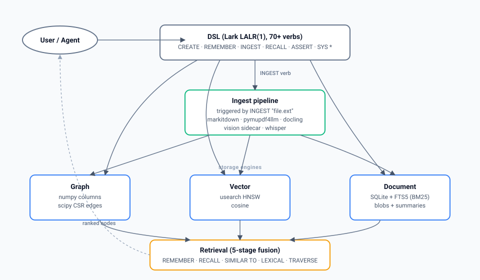
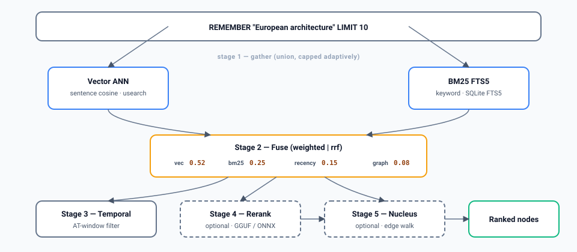

<div align="center">

# graphstore

**Memory infrastructure for AI agents**

[](https://github.com/orkait/graphstore/actions/workflows/ci.yml)
[](https://pypi.org/project/graphstore/)
[](https://pypi.org/project/graphstore/)
[](https://python.org)
[](LICENSE)
[](https://sqlite.org)
[](https://github.com/unum-cloud/usearch)

</div>

---

graphstore gives AI agents persistent, queryable memory. Store nodes and edges with a simple DSL; retrieve by meaning, by association, by text, or any combination - one call. Runs in-process, persists to SQLite. No server, no infrastructure.

## ⚡ 60-second start

```bash
pip install graphstore
```

```python
from graphstore import GraphStore

g = GraphStore(path="./brain")

# Store: DOCUMENT populates vector + BM25 + blob in one shot
g.execute('CREATE NODE "mem:paris" kind = "memory" '
          'DOCUMENT "Paris is the capital of France, famous for the Eiffel Tower."')
g.execute('CREATE NODE "mem:rome" kind = "memory" '
          'DOCUMENT "Rome is the capital of Italy, home to the Colosseum."')
g.execute('CREATE EDGE "mem:paris" -> "mem:rome" kind = "both_european_capitals"')

# Retrieve - four primitives, all backed by the three storage engines
g.execute('REMEMBER "European history" LIMIT 5')          # hybrid fusion
g.execute('RECALL FROM "mem:paris" DEPTH 2 LIMIT 10')     # graph walk
g.execute('LEXICAL SEARCH "Eiffel Tower" LIMIT 5')        # BM25
g.execute('SIMILAR TO "capital city" LIMIT 5')            # cosine only

g.close()
```

That's it. Core install covers REMEMBER / RECALL / LEXICAL / SIMILAR / SYS CRON / VAULT SYNC. Extras for PDF, image, audio, GPU, playground UI are all opt-in - see [Installation](#-installation).

### Prefer typed Python over DSL strings?

Use the built-in query builder. Every DSL verb is a typed function - escape-safe, IDE-autocomplete-friendly, composable.

```python
from graphstore import q, F

# Same three queries as above, via the builder:
q.create_node("mem:paris", kind="memory",
              document="Paris is the capital of France.").execute(g)
q.remember("European history", limit=5).execute(g)
q.nodes(where=F.eq("kind", "memory") & F.gt("importance", 0.5), limit=10).execute(g)
```

100% DSL coverage (87 verbs). Full reference: [docs/query-builder.md](docs/query-builder.md).

---

## Why graphstore?

Most agent memory systems are wrappers around a vector database. That works for simple retrieval but breaks down when you need:

- **Multi-signal retrieval** - vector similarity alone misses keyword matches. BM25 alone misses semantic matches. You need both, plus graph structure, plus recency, fused intelligently.
- **Graph-native operations** - spreading activation, subgraph extraction, path queries, counterfactual reasoning. These aren't afterthoughts - they're first-class DSL commands.
- **Temporal awareness** - knowing WHEN something happened matters as much as WHAT happened. `__event_at__` is a reserved column, not a hack.
- **Belief tracking** - agents deal with uncertain, contradictory facts. ASSERT with confidence, RETRACT when wrong, find CONTRADICTIONS automatically.
- **Zero infrastructure** - everything is SQLite + numpy + usearch. No Docker, no server, no cloud dependency.

---

## 🏗️ How it works

Three storage engines, one typed DSL, a tiered ingest pipeline, and a hybrid retrieval engine that fuses all of them.

<p align="center">
  
</p>

**What flows where:**

- The **DSL** (Lark LALR(1), ~70 verbs) is the only way in. Every `CREATE`, `UPDATE`, `DELETE`, `ASSERT`, `RETRACT`, `INGEST`, `SYS *` goes through it.
- **Direct writes** (`CREATE NODE`, `ASSERT`, `UPDATE`, `CREATE EDGE`, …) land straight in the three engines:
  - **Graph** - typed numpy columns + scipy CSR edges. Reserved columns like `__event_at__`, `__confidence__`, `__retracted__` live here.
  - **Vector** - usearch HNSW with cosine. Auto-populated via schema `EMBED content` or the `DOCUMENT "..."` clause.
  - **Document** - SQLite + FTS5 virtual table. BM25 + blob storage + single-owner path lock.
- **`INGEST "file.ext"`** is itself a DSL verb. It dispatches to the ingest pipeline, which is tiered and modality-aware: `txt/md` → direct · `html/docx/xlsx` → markitdown · `pdf` → pymupdf4llm → docling · `png/jpg` → vision sidecar (local llama.cpp + SmolVLM2-2.2B default, `[vision]` extra) · `wav/mp3/flac/m4a` → whisper in-process (faster-whisper, `[audio]` extra). The pipeline's output flows into the same three engines.
- **Retrieval** (REMEMBER / RECALL / SIMILAR TO / LEXICAL SEARCH / TRAVERSE) reads from all three engines and fuses the signals - see the pipeline diagram below.

<sub>Source: [`docs/img/architecture.svg`](docs/img/architecture.svg) - hand-authored, edit directly.</sub>

### REMEMBER - the retrieval engine

`REMEMBER` is the core command. Five-stage pipeline, four weighted signals, optional rerank + nucleus walk.

<p align="center">
   fuse -> temporal -> rerank -> nucleus" width="620">
</p>

<sub>Source: [`docs/img/remember.svg`](docs/img/remember.svg) - hand-authored, edit directly.</sub>

**Signals fused at stage 2** (defaults; weights are configurable):

| Signal | Weight | Source |
|---|---|---|
| `vec_signal` | 0.52 | max sentence cosine over usearch ANN |
| `bm25_signal` | 0.25 | SQLite FTS5 over `doc_fts` |
| `recency` | 0.15 | `exp(-age / half_life)` from `__event_at__` or `__updated_at__` |
| `graph_signal` | 0.08 | entity-degree sum over mentioned entities (opt-in) |
| `+ co-occurrence` | bonus | `min(vec, bm25) * 0.10` when a candidate is found by both |
| `+ recall-frequency` | nudge | `log1p(recall_count) * 0.05` |

Everything above is configurable via `graphstore.json`, `GRAPHSTORE_DSL_*` env vars, or constructor kwargs.

---

## 📦 Installation

```bash
pip install graphstore
```

Core install includes everything needed for the agentic DB contract out of the box: REMEMBER / RECALL (model2vec embedder), SYS CRON (croniter), VAULT SYNC (pyyaml), plus the numpy / scipy / usearch / lark / msgspec / psutil / threadpoolctl foundation. No torch, no PDF parser, no HTTP server.

```bash
# PDF / DOCX / HTML ingestion (+200 MB)
pip install 'graphstore[ingest]'

# Local VLM sidecar for scanned PDFs / image captioning (+80 MB wheel, ~1.5 GB weights on first use)
pip install 'graphstore[vision]'

# GPU acceleration for NER (Linux x86_64, CUDA 12)
pip install 'graphstore[gpu]'

# Everything heavy
pip install 'graphstore[ingest,vision,playground]'
```

<details>
<summary><strong>All extras</strong></summary>

| Extra | What it adds |
|---|---|
| `ingest` | markitdown + pymupdf + pymupdf4llm (PDF/DOCX/HTML -> markdown) |
| `ingest-pro` | docling (heavier PDF w/ tables + OCR; ~1 GB via torch. For CPU-only install: `pip install 'graphstore[ingest-pro]' --extra-index-url https://download.pytorch.org/whl/cpu`) |
| `vision` | llama-cpp-python[server] + huggingface-hub (local VLM sidecar, SmolVLM2-2.2B Q4_K_M ~1.5 GB on first use; see `graphstore vision serve`) |
| `audio` | faster-whisper (in-process speech-to-text; tiny/base models ~40-150 MB on first use) |
| `embedders-extra` | fastembed + llama-cpp-python (alternate embedder backends; model2vec is the default and lives in core) |
| `playground` | fastapi + uvicorn (local web UI) |
| `gpu` | onnxruntime-gpu only (bring your own CUDA 12 + cuDNN 9) |
| `dev` | pytest + pytest-benchmark + pytest-xdist + pytest-timeout |

</details>

---

> **Heads up.** Plain `CREATE NODE "id" kind = "X" topic = "..."` without a `DOCUMENT` clause stores typed columns only - REMEMBER and LEXICAL will return zero for that node. Use `DOCUMENT "text"` whenever the node's *content* is what you want to retrieve on.

Everything persists to `./brain/` as SQLite. Reopen with the same path and all memories are back.

---

## 🧠 What you can do

### Store and recall memories

```sql
-- Store a retrievable memory: DOCUMENT populates vector + BM25 + blob in one shot.
CREATE NODE "mem:123" kind = "memory" topic = "finance"
  DOCUMENT "Q3 revenue beat expectations driven by enterprise renewals."

-- Hybrid retrieval (5-signal fusion over vector + BM25 + recency + graph + confidence)
REMEMBER "quarterly revenue trends" TOKENS 4000

-- Graph traversal (spreading activation along edges)
RECALL FROM "concept:finance" DEPTH 3 LIMIT 10

-- Keyword search (BM25 over FTS5)
LEXICAL SEARCH "Q3 revenue" LIMIT 10

-- Vector similarity (pure cosine, no fusion)
SIMILAR TO "budget forecasting" LIMIT 10

-- Temporal retrieval (recency-weighted + hard filter on AT window)
REMEMBER "what happened in May" AT "2024-05" LIMIT 10
```

### Ingest documents

```sql
INGEST "report.pdf" AS "doc:q3" KIND "report"
SYS CONNECT    -- auto-wire similar chunks across documents
```

Core install handles `txt / md / csv / json / html`. File formats that need extra machinery:

| Extra | Formats | How |
|---|---|---|
| `[ingest]` | `pdf / docx / xlsx / pptx / html` | markitdown → pymupdf4llm (PDFs) |
| `[ingest-pro]` | same + `tex / adoc / tiff / bmp` + richer PDFs | docling (~1 GB, pulls torch) |
| `[vision]` | `png / jpg / webp` + scanned PDF fallback | local llama.cpp sidecar + SmolVLM2-2.2B (~1.5 GB on first call); auto-starts on first `INGEST ... USING VISION` |
| `[audio]` | `wav / mp3 / flac / m4a / opus / webm` | in-process faster-whisper (~150 MB on first call); timestamp-tagged chunks |

```sql
INGEST "scan.pdf"                                     -- whatever tier applies
INGEST "chart.png" USING VISION "smolvlm2-2.2b"
INGEST "interview.mp3"                                -- needs [audio]
```

Bring your own VLM endpoint (Ollama, vLLM, OpenAI) via `GRAPHSTORE_VISION_URL`. See `graphstore vision {serve|stop|status|logs|models}` for the local sidecar.

### Beliefs, time, consolidation, evolution

```sql
ASSERT "fact:earth-radius" value = 6371 kind = "fact" CONFIDENCE 0.99 SOURCE "physics-tool"
RETRACT "fact:old-preference" REASON "user corrected this"
SYS CONTRADICTIONS WHERE kind = "belief" FIELD value GROUP BY topic

-- When-it-happened, not just when-ingested
CREATE NODE "event:trip" kind = "event" content = "visited Paris" EVENT_AT "2024-03-15"
REMEMBER "trip plans" AT "2024-03" LIMIT 10

-- Cluster episodic memories, no LLM needed
SYS CONSOLIDATE THRESHOLD 0.7
```

<details>
<summary><strong>More features</strong> (TTL, snapshots, cron, evolution rules, vault, contexts, graph walks)</summary>

```sql
-- TTL + hard delete
CREATE NODE "scratch:temp" kind = "working" data = "..." EXPIRES IN 30m
SYS EXPIRE WHERE kind = "working"
FORGET NODE "mem:old"

-- Snapshot reasoning branches
SYS SNAPSHOT "before-hypothesis"
SYS ROLLBACK TO "before-hypothesis"

-- Scheduled maintenance (needs queued=True)
SYS CRON ADD "expire-ttl" SCHEDULE "@hourly" QUERY "SYS EXPIRE"

-- Self-tuning rules
SYS EVOLVE RULE "reindex-on-drift"
  WHEN recall_hit_rate <= 0.4
  THEN RUN SYS REEMBED
  COOLDOWN 86400

-- Markdown vault
-- python: GraphStore(path="./brain", vault="./notes")
VAULT NEW "Project Requirements" KIND "context"
VAULT SEARCH "deployment requirements" LIMIT 5

-- Context isolation
BIND CONTEXT "reasoning-session-42"
CREATE NODE "hyp:1" kind = "hypothesis" content = "maybe X"
DISCARD CONTEXT "reasoning-session-42"

-- Graph walks
TRAVERSE FROM "id" DEPTH 3
PATH FROM "a" TO "b" MAX_DEPTH 5
ANCESTORS OF "id" DEPTH 3
COMMON NEIGHBORS OF "a" AND "b"
AGGREGATE NODES WHERE kind = "memory" GROUP BY topic SELECT COUNT(), AVG(importance)
```

</details>

---

## ⚡ Performance

Median latency over 30 iters, model2vec 256-dim embeddings, 16-core CPU @ 2-thread BLAS cap (graphstore's default). Reproduce on your box: `python benchmarks/micro_latency.py`. Last measured 2026-04-19.

| Operation | In-memory | On-disk | Notes |
|---|---|---|---|
| Point lookup `NODE "id"` | **5 us** | 11 us | hash → slot |
| Filtered scan `NODES WHERE ... LIMIT 10` | **14 us** | 51 us | typed column filter |
| Semantic search `SIMILAR TO "..." LIMIT 10` | **87 us** | 175 us | usearch HNSW ANN |
| Graph traversal `RECALL DEPTH 3` | ~1 ms | ~1 ms | spreading activation |
| Hybrid retrieval `REMEMBER LIMIT 10` | ~6 ms | ~50 ms | 4-signal fusion (scales with candidate set) |
| `ASSERT` | 11 us | 4 ms | disk path pays WAL sync per call |
| Memory per node | ~1.6 KB | ~1.6 KB | ~80 bytes typed columns + ~1 KB vector + overhead |

Disk numbers at **100k nodes**, in-memory numbers at **10k nodes** (disk WAL sync dominates at small N, ANN tree depth dominates at large N). REMEMBER scales with the number of candidates the ANN + FTS leg return - realistic workloads have << 100 matches and the fused pipeline drops to single-digit ms.

### Benchmark results

> **Metric callout.** graphstore ships retrieval numbers, not end-to-end QA accuracy. *Retrieval accuracy* below means "did the gold-answer-bearing passage land in the retrieved top-K". End-to-end QA with an LLM reader is a strict superset and lives in the linked methodology doc.

**LongMemEval-S** - 500 records, retrieval-only, Jina v5 Small 1024d, Kaggle T4 GPU, 2026-04-19 run. Public kernel (full logs + output + reproducible in-browser): [kaggle.com/code/superkaiii/graphstore-jina-v5-small](https://www.kaggle.com/code/superkaiii/graphstore-jina-v5-small).

| Category | n | Retrieval accuracy |
|---|---|---|
| knowledge-update | 78 | 100.0% |
| multi-session | 133 | 98.5% |
| single-session-assistant | 56 | 100.0% |
| single-session-user | 70 | 98.6% |
| temporal-reasoning | 133 | 94.7% |
| single-session-preference | 30 | 83.3% |
| **Overall** | **500** | **97.0%** |

Latency on that run: query p50 46 ms / p95 76 ms, ingest p50 1035 ms / p95 1070 ms. Memory delta +283 MB across 23,867 ingest ops. 5 h 20 m wall, no LLM judge, zero API calls. See [docs/benchmarks.md](docs/benchmarks.md) for the comparison band (Mem0, MemGPT, Zep).

**LoCoMo** - 50Q, token-level F1 from retrieved passages, MiniMax M2.7 reader, Jina v5 Small 1024d:

| Category | F1 |
|---|---|
| open-domain | 0.452 |
| multi-hop | 0.418 |
| adversarial | 0.500 |
| single-hop | 0.224 |
| temporal | 0.189 |
| **Overall** | **0.357** |

For context: GPT-3.5-turbo with full conversation context scores 0.378 on LoCoMo. graphstore hits comparable quality using only retrieved passages (no full context), with a smaller reader LLM.

**Retrieval recall at K** (keyword in top-K, no LLM):

| K | Recall |
|---|---|
| top-5 | 60% |
| top-10 | 80% |
| top-20 | 84% |
| top-50 | 96% |

**BEAM** - included via `benchmarks/framework/run_beam.py`, generates BEAM-compatible answer JSON for external evaluation.

Full methodology, reproduction instructions, and comparison with Mem0 / MemGPT / Zep: see [docs/benchmarks.md](docs/benchmarks.md).

All three benchmarks run from one CLI:
```bash
python -m benchmarks.framework.cli run --dataset longmemeval --data-path ./data --variant s
python -m benchmarks.framework.cli run --dataset locomo --data-path ./data
python -m benchmarks.framework.cli run --dataset beam --data-path /tmp/BEAM --variant 16k --end-index 10
```

---

## ⚙️ Configuration

```python
g = GraphStore(
    path="./brain",
    ceiling_mb=256,
    embedder="default",           # "default" (model2vec, core), "none", "installed:<name>", or an Embedder
    queued=True,                  # worker-thread write queue + cron scheduler
    vault="./notes",              # markdown vault (None = disabled)
    fusion_method="weighted",     # "weighted" or "rrf"
    recency_half_life_days=7300,  # ~20 years - agent memory decays slowly
    graph_signal_enabled=True,    # fold entity-degree channel into REMEMBER
    nucleus_expansion=False,      # off by default; walks structural edges after rerank
    # Vision (only used when INGEST ... USING VISION fires)
    # vision_base_url=None,       # None -> auto-resolve sidecar -> env -> error
    # vision_model="SmolVLM2-2.2B-Instruct-Q4_K_M.gguf",
    # vision_max_tokens=512,
)
```

Config is loaded in layers: `config.py` defaults → `graphstore.json` overrides → `GRAPHSTORE_*` env vars → constructor kwargs.

**Single-owner per path.** Persistent stores take an advisory lock on `<path>/.graphstore.lock`. A second `GraphStore(path=...)` against the same path raises `StoreInUse` - WAL replay + compact + checkpoint are not safe across processes. In-memory stores are unlocked. OS reclaims the lock on process exit.

**Thread safety.** Default is single-threaded. `queued=True` installs a worker thread that serialises writes from multiple callers. BLAS thread count is capped at import time (`OMP_NUM_THREADS=2` by default; override with `GRAPHSTORE_BLAS_CAP=N`) so importing graphstore doesn't saturate all cores.

<details>
<summary><strong>graphstore.json reference</strong></summary>

Only include fields you want to override. Missing fields use defaults from `config.py`.

```json
{
  "core": {
    "ceiling_mb": 512,
    "embed_batch_size": 64
  },
  "vector": {
    "search_oversample": 16,
    "similarity_threshold": 0.85,
    "embedder": "default",
    "model2vec_model": "minishlab/M2V_base_output"
  },
  "document": {
    "chunk_max_size": 2000,
    "chunk_overlap": 50,
    "vision_model": "SmolVLM2-2.2B-Instruct-Q4_K_M.gguf",
    "vision_base_url": null,
    "vision_max_tokens": 512
  },
  "dsl": {
    "fusion_method": "weighted",
    "remember_weights": [0.52, 0.25, 0.15, 0.08],
    "recency_half_life_days": 7300,
    "graph_signal_enabled": true,
    "sentence_query_expansion": true,
    "nucleus_expansion": false,
    "reranker": null
  }
}
```

Environment overrides (flattened by section): `GRAPHSTORE_CORE_CEILING_MB=512`, `GRAPHSTORE_DSL_FUSION_METHOD=rrf`, `GRAPHSTORE_VISION_URL=http://...`, `GRAPHSTORE_VISION_MODEL=smolvlm-500m`, `GRAPHSTORE_VLM_CACHE_DIR=/mnt/cache/vlm`.

Inspect from the CLI:

```bash
graphstore config --defaults    # dump current defaults as JSON
graphstore config --schema      # JSON Schema for graphstore.json
graphstore config --path graphstore.json   # show resolved values
```

</details>

---

## 📖 DSL Reference

<details>
<summary><strong>Reads (25+ commands)</strong></summary>

```sql
NODE "id"
NODE "id" WITH DOCUMENT
NODES WHERE kind = "memory" AND importance > 0.5 LIMIT 10
EDGES FROM "id" WHERE kind = "calls"
TRAVERSE FROM "id" DEPTH 3
SUBGRAPH FROM "id" DEPTH 2
PATH FROM "a" TO "b" MAX_DEPTH 5
SHORTEST PATH FROM "a" TO "b"
ANCESTORS OF "id" DEPTH 3
DESCENDANTS OF "id" DEPTH 3
COMMON NEIGHBORS OF "a" AND "b"
MATCH ("fn_main") -[kind = "calls"]-> (callee)
COUNT NODES WHERE kind = "memory"
AGGREGATE NODES GROUP BY kind SELECT COUNT()
RECALL FROM "id" DEPTH 3 LIMIT 10
SIMILAR TO "text" LIMIT 10
SIMILAR TO NODE "id" LIMIT 10
SIMILAR TO [0.1, 0.2, ...] LIMIT 10
LEXICAL SEARCH "phrase" LIMIT 10
REMEMBER "query" LIMIT 10
REMEMBER "query" AT "2024-03" TOKENS 4000
WHAT IF RETRACT "id"
```

</details>

<details>
<summary><strong>Writes (15+ commands)</strong></summary>

```sql
CREATE NODE "id" kind = "x" name = "foo"
CREATE NODE "id" kind = "x" EVENT_AT "2024-03-15"
CREATE NODE "id" kind = "x" EXPIRES IN 1h DOCUMENT "full text..."   -- DOCUMENT auto-populates BM25 + vector + blob (PR #102). EXPIRES must come before DOCUMENT.
UPDATE NODE "id" SET name = "new"
UPSERT NODE "id" kind = "x" name = "foo"
DELETE NODE "id"
DELETE NODES WHERE kind = "test"
UPDATE NODES WHERE kind = "fact" SET confidence = 0.5
CREATE EDGE "src" -> "tgt" kind = "calls"
INCREMENT NODE "id" hits BY 1
ASSERT "id" kind = "fact" value = 42 CONFIDENCE 0.9 SOURCE "tool" EVENT_AT "2024-01"
RETRACT "id" REASON "outdated"
MERGE NODE "old" INTO "canonical"
PROPAGATE "id" FIELD confidence DEPTH 3
INGEST "file.pdf" AS "doc:q3" KIND "report"
FORGET NODE "id"
BIND CONTEXT "session-1"
DISCARD CONTEXT "session-1"
BEGIN ... COMMIT
```

</details>

<details>
<summary><strong>System (30+ commands)</strong></summary>

```sql
SYS STATUS / SYS STATS / SYS HEALTH
SYS KINDS / SYS EDGE KINDS / SYS DESCRIBE NODE "memory"
SYS REGISTER NODE KIND "memory" REQUIRED topic:string EMBED content
SYS CONNECT / SYS CONNECT THRESHOLD 0.9
SYS CONSOLIDATE THRESHOLD 0.7
SYS DUPLICATES THRESHOLD 0.95
SYS CONTRADICTIONS WHERE kind = "belief" FIELD value GROUP BY topic
SYS EXPIRE WHERE kind = "working"
SYS SNAPSHOT "name" / SYS ROLLBACK TO "name"
SYS EMBEDDERS / SYS REEMBED
SYS RETAIN / SYS EVICT
SYS CHECKPOINT / SYS REBUILD INDICES / SYS CLEAR CACHE
SYS OPTIMIZE / SYS OPTIMIZE COMPACT
SYS LOG LIMIT 20 / SYS LOG TRACE "id"
SYS CRON ADD "name" SCHEDULE "0 * * * *" QUERY "SYS EXPIRE"
SYS EVOLVE RULE "name" WHEN signal OP value THEN action COOLDOWN n
SYS EVOLVE LIST / SHOW / ENABLE / DISABLE / DELETE / HISTORY
```

</details>

---

## 🏗️ Project structure

<details>
<summary>Expand</summary>

```
graphstore/
  store.py                # Main GraphStore entry point
  config.py               # Typed config (msgspec Structs)
  wal.py                  # Write-ahead log
  cron.py                 # Scheduled jobs (croniter, now core)
  core/                   # Graph engine (numpy + CSR + columns) + evolve/ self-tuning
  dsl/                    # Query language (grammar + parser + handlers)
    handlers/             # Sharded by domain (mutations, traversal, beliefs, intelligence, ...)
    sys/                  # SYS command shards (lifecycle, pipeline, queries, schema, cron)
  algos/                  # Pure algorithms (fusion, spreading, consolidation)
  embedding/              # model2vec (core default) + fastembed/GGUF/ONNX (extras)
  vector/                 # usearch ANN index
  document/               # SQLite FTS5 + blob storage
  ingest/                 # File -> graph pipeline
    vision.py             # OpenAI-compat HTTP client to VLM endpoint
    vision_sidecar.py     # Local llama.cpp sidecar launcher (under [vision])
  vault/                  # Markdown note system (pyyaml, now core)
  registry/               # Embedder download + cache
  persistence/            # SQLite serialization
  server.py               # Playground web UI (under [playground])
  cli.py                  # CLI (install-embedder, playground, vision, config)
benchmarks/
  framework/
    cli.py                # Unified benchmark CLI (longmemeval, locomo, beam)
    runner.py             # Generic per-record evaluation loop
    run_locomo.py         # LoCoMo protocol (F1 scoring)
    run_beam.py           # BEAM protocol (answer generation)
    run_longmemeval.py    # LongMemEval native (NDCG, per-type)
    adapters/graphstore_.py  # Benchmark adapter
  kaggle/                 # Kaggle notebook entries
  algos/                  # Algorithm micro-benchmarks
```

</details>

---

## 🛠️ Development

```bash
git clone https://github.com/orkait/graphstore.git
cd graphstore
python -m venv .venv && source .venv/bin/activate
pip install -e ".[dev,ingest,vision,embedders-extra,playground]"
pytest     # 1183+ tests, ~17s on 8-core CPU with -n 4
```

---

## 📄 License

AGPL-3.0 - see [LICENSE](LICENSE).
</div>
